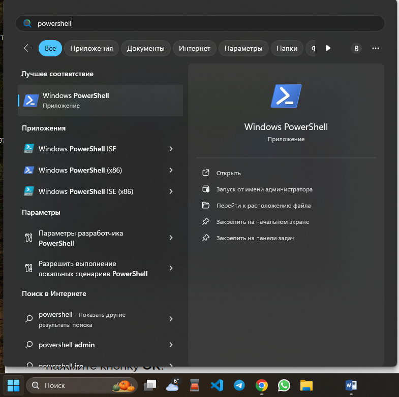
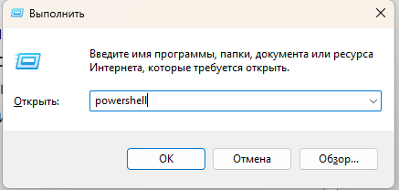

# <center>Interaction with Windows API through  PowerShell</center>

**1. GENERAL  INFORMATION**

**1.1 Microsoft Windows API**

Microsoft Windows API is a system programming interface for Windows operating systems. It is used to write applications that can interact with the operating system.

<p align="center">
  
</p>

Windows API (Win32) is oriented primarily to the C programming language, because its functions and data structures are described in that language. However, the API may be used by any programming language compiler or assembler able to handle the (well-defined) low-level data structures along with prescribed calling conventions for calls and callbacks.

**1.2 PowerShell**

**PowerShell** is a standardized command line shell that provides access to more flexible computer management and settings. This is the same command line, but with greater capabilities for the MS Windows family operating systems configuring. It is a kind of universal administration tool.

Unlike most shells, which only accept and return text, PowerShell accepts and returns .NET objects. This solution offers the following features:

* reliable command line log;
* filling by pressing the TAB key and substituting commands;
* support for command and parameter aliases;
* creation of an assembly line for command merge;
* console help system, similar to ``man`` pages in Unix

**1.3 PowerShell commands**

PowerShell has its own set of commands called cmdlets. They are formed with the “Verb-Noun” or “Action-Object” pattern. For example, ``Get-Services`` and ``Start-Process``.

**Basic Windows PowerShell Commands**

The table below lists the main PowerShell commands and their analogues in *nix-like systems and CMD.EXE.

| Cmdlets 	| Command in *nix 	| Command in CMD.exe 	|                    Description                   	|
|:---------------------:	|:--------------:	|:-----------------:	|:---------------------------------------------:	|
|   Get-Location (pwd)  	|       pwd      	|                   	|       Displays the path to the current directory       	|
|   Set-Location (cd)   	|       cd       	|         cd        	|             Changes the current directory            	|
|   Get-ChildItem (ls)  	|       ls       	|        dir        	|      Displays the content of the current directory     	|
| Get-ChildItem         	|      find      	|        find       	| Searches for files based on specified criteria 	|
| Copy-Item (cp)        	|       cp       	|         cp        	|                 Copies a file                 	|
| Remove-Item (rm)      	|       rm       	|         rm        	|                  Deletes a file                 	|
| New-Item (mkdir)      	|      mkdir     	|       mkdir       	|                Creates a directory                	|
| New-Item              	|      touch     	|                   	|              Creates an empty file              	|
| Get-Content (cat)     	|       cat      	|                   	|                 Displays files                 	|

**1.4 Syntax**

The name of the cmdlet is followed by an indication of the parameters and their values. All parts of the command should be separated with spaces.

Example: ``Set-Location -LiteralPath C:\ -PassThru``

Let's study the example:

* ``Set-Location`` – means “call a command”. Allows you to run the specified script block.
* ``-LiteralPath C:\`` – is needed to pass a script block that uses the ``Set-Location`` command to navigate to the C:\ directory.
* ``-PassThru`` – by default, the ``Invoke-Command`` cmdlet does not return execution results. This parameter specifies the necessity to display information about the location navigated by the ``Set-Location`` command.

The case of letters in PowerShell commands does not matter; commands will be executed in any case.

When multiple commands are combined on one line, they are separated with a semicolon ``;``.

If the command is too long, use a backtick `` ` `` instead of a hyphen to split it into multiple lines. A new line can be created by pressing **Shift + Enter** (to move a line below the current one) or **Ctrl + Enter** (to move a line above the current one).

**2. GETTING STARTED**

**2.1 How to start PowerShell on Windows?**

By default, PowerShell is already installed on your computer. If not, then use the installation instructions provided by Microsoft.

There are two main ways to launch PowerShell on Windows: through the «Start» menu and through the «Run» application.

**From the «Start» menu:**

<p align="center">
  
</p>

**Through the «Run» application:**

use **Win + R** combination. In the window appeared enter powreshell and click **OK**.

<p align="center">
  
</p>

**2.2 Interaction with Windows API though PowerShell**

In Windows PowerShell, there are three ways to interact with Windows API functions:

1. Use the ``Add-Type`` cmdlet to compile the C# code;
2. Use a reference to a private type in the .NET Framework to call this method;
3. Use reflection to determine the method that calls the Windows API function.

2.3 Using the Add-Type cmdlet to call a function

The key to interacting with WinAPI functions through PowerShell is to know how to convert types in C/C++ functions to their .NET framework equivalents. You can use <code>[pinvoke.net]("http://www.pinvoke.net/")</code> website for this purpose.

On the <code>[pinvoke.net]("http://www.pinvoke.net/")</code> website in the search bar you need to specify the name of the desired function from WinAPI, for example, ``CopyFile``. The search result will be the signature of the equivalent C# function.

```[DllImport(“kernel32.dll”, CharSet = CharSet.Unicode)]```

```static extern bool CopyFile(string lpExistingFileName, string lpNewFileName, bool bFailIfExists);```

Next, you need to use the ``Add-Type`` cmdlet to interact with the found C# function. This cmdlet allows you to compile C# code added to it on the fly.

Let's add the found ``CopyFile`` function to the PowerShell script:

```$MethodDefinition = @’```

```[DllImport(“kernel32.dll”, CharSet = CharSet.Unicode)]```

```public static extern bool CopyFile(string lpExistingFileName, string lpNewFileName, bool bFailIfExists);```

```‘@```

```Add-Type -MemberDefinition $MethodDefinition -Name ‘Kernel32’ -Namespace ‘Win32’ -PassThru```

The ``MethodDefinition`` variable contains the signature of the ``CopyFile`` function found on pinvoke.net with one change: the CopyFile function is declared public, since functions that are added using Add-Type must be public for ease of interaction with PowerShell.

Next, the ``Add-Type`` call provides access to C# code by specifying the type name and namespace. After calling ``Add-Type``, you can use the new type in PowerShell as [Win32.Kernel32].

For example, now you can call the ``CopyFile`` function from PowerShell with the command:

```[Win32.Kernel32]::CopyFile("C:\Documents\file_1.txt ",  "C:\Documents\file_2.txt", $False)```

This command will copy file_1.txt to file_2.txt.

After all these steps we are able to call the ``CopyFile`` function from WinApi in PowerShell.
